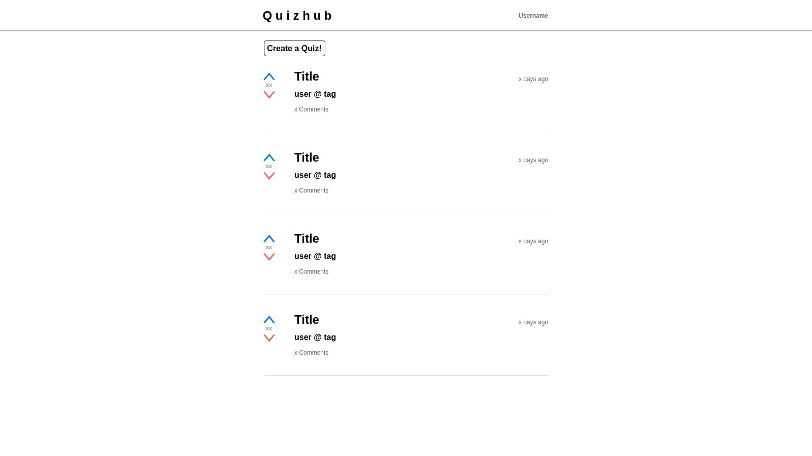
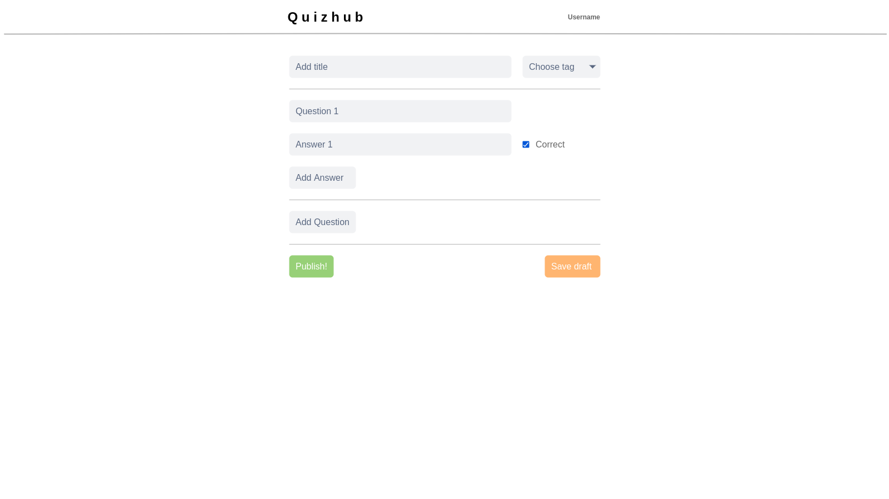
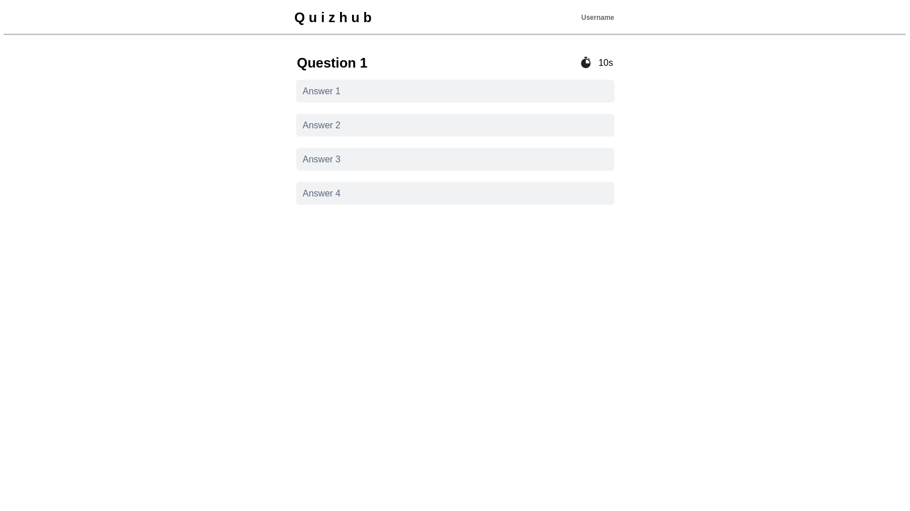
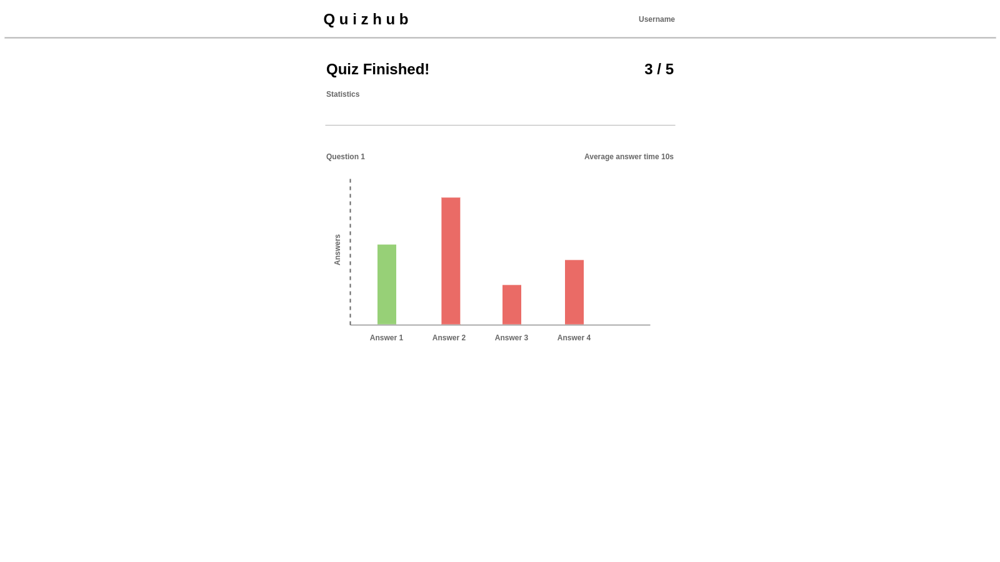
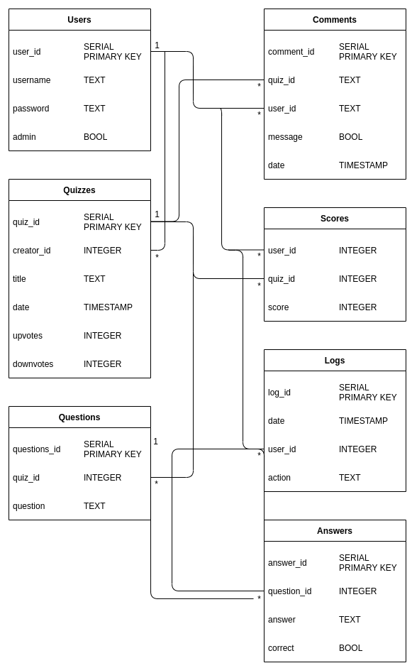

# Quizhub
Database project built with Flask and PostgreSQL for hy-tsoha.

Deployed to heroku at https://tsoha-quizhub.herokuapp.com/ . Login by pressing "Login/Register" button at top right corner. Use the existing accounts marked belowe or create a new one. After logging in you are redirected to the main page and can now play the quizzes or create one yourself. When entering a quiz, click one of the options to progress. After you have gone through all the questions, you will see the results. When creating a new quiz, enter the title of the quiz and press "Add New Question" at least once. Fill in the fields and either add a new question or press "Publish". Publishing a makes it visible to all the users. 

Existing accounts:
| username | password | admin |
| - | - | - |
| user | password | False |
| admin | password | True |

## Description
- Generic social media like feed where posts are quizzes
- A quiz consists of multiple questions and answers to choose from
- After the quiz is over, the user can comment, rate the quiz, and is rewarded points based on their speed and accuracy
- All the users can create and take part in quizzes
- Admins can remove quizzes, users, and comments

## Views
**Bolded** tasks are main features.

### Feed (index.html)
- [x] **Display quizzes in creation order**
- [x] **Open the quiz on click**
- [x] **Create a quiz button**
- [ ] Add sorting
- [ ] Add search

### Quiz (quiz/\<int>.html)
- [x] **Opens to a new page**
- [x] **Display a question and multiple choices**
- [x] **Reward points after completion**
- [ ] **Rate the quiz**
- [ ] **Add comments**
- [x] **An admin can remove the quiz**
- [x] Correct/Incorrect answers per question (statistics)

### Create user (register.html)
- [x] **Form with username and password fields**
- [x] **On submit check if the username is taken**
- [x] **Hash the password before saving**

### Login (login.html)
- [x] **Form with username and password fields**
- [x] **On submit check if the password hash is correct and login**

### Create quiz (create.html)
- [x] **Quiz name**
- [x] **Add question and up to 4 answers choices**
- [x] **Ability add multiple questions**
- [ ] Save draft
- [ ] Add tags
- [ ] Human verification before publishing

### Profile page (profile/\<int>.html)
- [ ] **Remove a quiz**
- [ ] **Remove account**
- [ ] Change password

## Database

[Schema](https://github.com/jpasikainen/tsoha-quizhub/blob/master/schema.sql)

- [x] Add bool published for quizzes 

